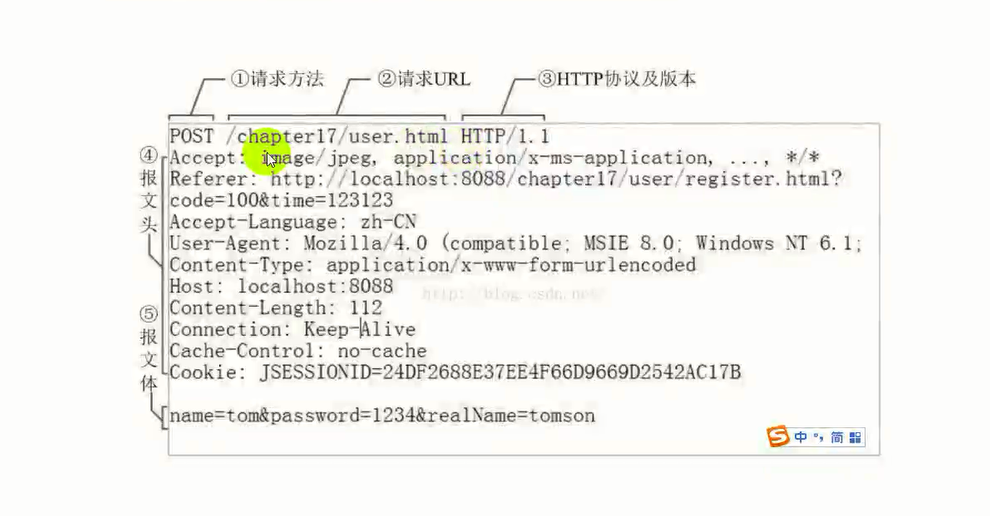
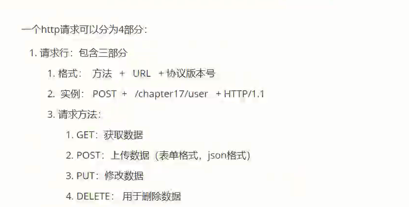
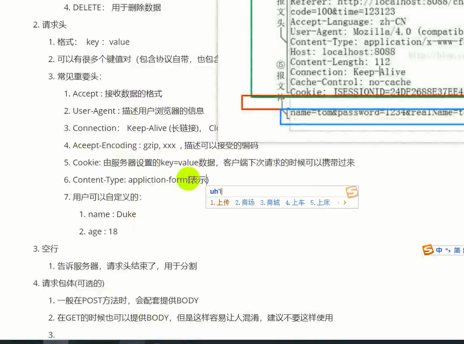

# 0x00 HTTP

- HTTP底层协议是 TCP（短连接🔗） IP








# 0x01发送包

 

```go
package main

import (
	"fmt"
	"io/ioutil"
	"net/http"
)

func main() {
	client := http.Client{}
	resp, err := client.Get("http://www.baidu.com")
	if err != nil {
		fmt.Println("net error:", err)
		return
	}

	date := resp.Header.Get("Date")
	server := resp.Header.Get("Server")
	ct := resp.Header.Get("Content-Type")
	fmt.Println(date)
	fmt.Println(server)
	fmt.Println(ct)
	body := resp.Request.Body
	fmt.Println(body)
	url := resp.Request.URL
	fmt.Println(url)
	//读取网页
	res, err := ioutil.ReadAll(resp.Body)
	fmt.Println(string(res))

}

```

# 0x02 构建http服务器

> http.ListenAndServer("ip:port",handler)


frist step简便写法

```
if err:= http.ListenAndServe("ip",handler); err != nil {
	error
	return 
}
```


> 注册 路径 xx/xx

```
http.HandleFunc("/user",绑定的函数)
```

```go
package main

import (
	"fmt"
	"io"
	"net/http"
)

func main() {
	http.HandleFunc("/hah", func(w http.ResponseWriter, r *http.Request) {
		//w 返回服务器信息
		//r 是客户端发来的请求数据
		fmt.Println("请求数据", r)
		// 写入数据
		_, _ = io.WriteString(w, "Hello World")
	})
	err := http.ListenAndServe("127.0.0.1:8080", nil)
	if err != nil {
		fmt.Println("err", err)
	}

}

```

